# FastAPI Authentication Flow

## Complete Request Flow: Login, Refresh, Logout, Protected Route Access

```mermaid
sequenceDiagram
    actor Client
    participant FastAPI as FastAPI Server
    participant DB as SQLite DB

    rect rgb(200, 220, 255)
    Note over Client,DB: 1. LOGIN FLOW
    Client->>FastAPI: POST /admin/login<br/>{username, password}
    FastAPI->>DB: get_admin_by_username(username)
    DB-->>FastAPI: AdminORM
    FastAPI->>FastAPI: verify_password(password, hash)
    FastAPI->>FastAPI: create_access_token(username, role)<br/>type='access', exp=15min
    FastAPI->>FastAPI: create_refresh_token(username)<br/>type='refresh', exp=7days
    FastAPI->>FastAPI: hash_token(refresh_token)
    FastAPI->>DB: save_refresh_token(hash, expires_at)
    DB-->>FastAPI: RefreshTokenORM saved
    FastAPI-->>Client: {access_token, refresh_token}
    Client->>Client: Store both tokens locally
    end

    rect rgb(200, 255, 220)
    Note over Client,DB: 2. PROTECTED ROUTE ACCESS
    Client->>FastAPI: GET /applications<br/>Authorization: Bearer {access_token}
    FastAPI->>FastAPI: Extract token from header
    FastAPI->>FastAPI: jwt.decode(token, SECRET_KEY)<br/>Validates: exp, signature
    FastAPI->>FastAPI: Check payload.type == 'access'<br/>(REJECT if 'refresh')
    FastAPI->>DB: get_admin_by_username(username)
    DB-->>FastAPI: AdminORM with role
    FastAPI->>FastAPI: Verify admin.is_active == True<br/>Check admin.role in allowed_roles
    FastAPI->>DB: list_all(db)<br/>Execute endpoint logic
    DB-->>FastAPI: [Application, ...]
    FastAPI-->>Client: 200 OK {applications}
    end

    rect rgb(255, 240, 200)
    Note over Client,DB: 3. REFRESH FLOW
    Client->>FastAPI: POST /admin/refresh<br/>{refresh_token}
    FastAPI->>FastAPI: hash_token(refresh_token)
    FastAPI->>DB: get_refresh_token(hash)
    DB-->>FastAPI: RefreshTokenORM
    FastAPI->>FastAPI: Check is_revoked == False
    FastAPI->>FastAPI: Check expires_at > now(utc)
    FastAPI->>FastAPI: jwt.decode(refresh_token)<br/>Validate type == 'refresh'
    FastAPI->>DB: get_admin_by_username(username)
    DB-->>FastAPI: AdminORM
    FastAPI->>FastAPI: create_access_token(username, role)<br/>NEW token, type='access'
    FastAPI-->>Client: {new_access_token}
    Client->>Client: Replace old access_token<br/>Keep refresh_token
    end

    rect rgb(255, 220, 220)
    Note over Client,DB: 4. LOGOUT FLOW
    Client->>FastAPI: POST /admin/logout<br/>{refresh_token}
    FastAPI->>FastAPI: hash_token(refresh_token)
    FastAPI->>DB: get_refresh_token(hash)
    DB-->>FastAPI: RefreshTokenORM
    FastAPI->>DB: revoke_refresh_token(hash)<br/>Set is_revoked = True
    DB-->>FastAPI: Updated RefreshTokenORM
    FastAPI-->>Client: 200 OK {message: logged out}
    Client->>Client: Clear tokens from storage
    end

    rect rgb(240, 220, 255)
    Note over Client,DB: AFTER LOGOUT: Refresh fails
    Client->>FastAPI: POST /admin/refresh<br/>{refresh_token}
    FastAPI->>DB: get_refresh_token(hash)
    DB-->>FastAPI: RefreshTokenORM with is_revoked=True
    FastAPI-->>Client: 401 Unauthorized<br/>{message: Invalid refresh token}
    end
```

## Security Highlights

- **Token Type Validation**: Refresh tokens are rejected on protected routes (`type='access'` check)
- **DB Source-of-Truth**: Refresh token revocation checked in database (can't bypass with old tokens)
- **Role Verification**: Admin role fetched from DB on every request (not cached in JWT)
- **Token Expiry**: Access tokens short-lived (15 min), refresh tokens long-lived (7 days)

## Endpoints Summary

| Endpoint | Method | Auth | Purpose |
|----------|--------|------|---------|
| `/admin/login` | POST | x-api-key | Get access + refresh tokens |
| `/admin/refresh` | POST | None | Get new access token using refresh token |
| `/admin/logout` | POST | None | Revoke refresh token |
| `/applications` | GET | Bearer token | List applications (requires admin role) |
| `/approve/{id}` | PATCH | Bearer token | Approve application (requires admin role) |
| `/delete/{id}` | DELETE | Bearer token | Delete application (requires superadmin role) |
