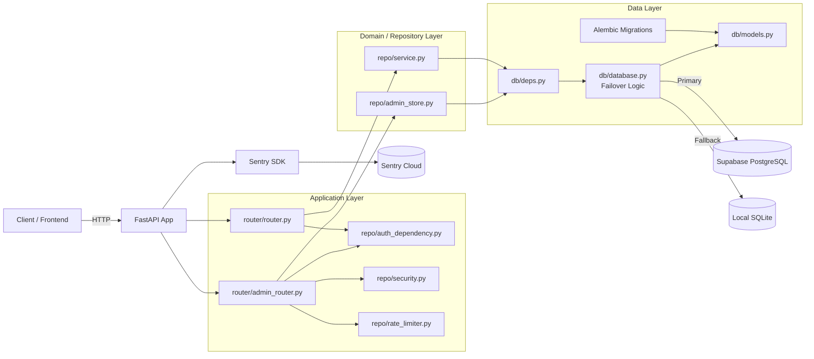

# Overall Architecture

```mermaid
flowchart LR
    C[Client / Frontend] -->|HTTP| API[FastAPI App]

    subgraph API_LAYER[Application Layer]
      AR[router/admin_router.py]
      RR[router/router.py]
      AD[repo/auth_dependency.py]
      SEC[repo/security.py]
      RL[repo/rate_limiter.py]
    end

    subgraph SERVICE_LAYER[Domain / Repository Layer]
      AS[repo/admin_store.py]
      SV[repo/service.py]
    end

    subgraph DATA_LAYER[Data Layer]
      DEP[db/deps.py]
      DB[db/database.py\nFailover Logic]
      ORM[db/models.py]
      MIG[Alembic Migrations]
    end

    API --> AR
    API --> RR
    AR --> AD
    RR --> AD
    AR --> SEC
    AR --> RL

    AR --> AS
    RR --> SV

    AS --> DEP
    SV --> DEP
    DEP --> DB
    DB --> ORM
    MIG --> ORM

    DB -->|Primary| SUPA[(Supabase PostgreSQL)]
    DB -->|Fallback| SQLITE[(Local SQLite)]

    API --> SEN[Sentry SDK]
    SEN --> SD[(Sentry Cloud)]
```
