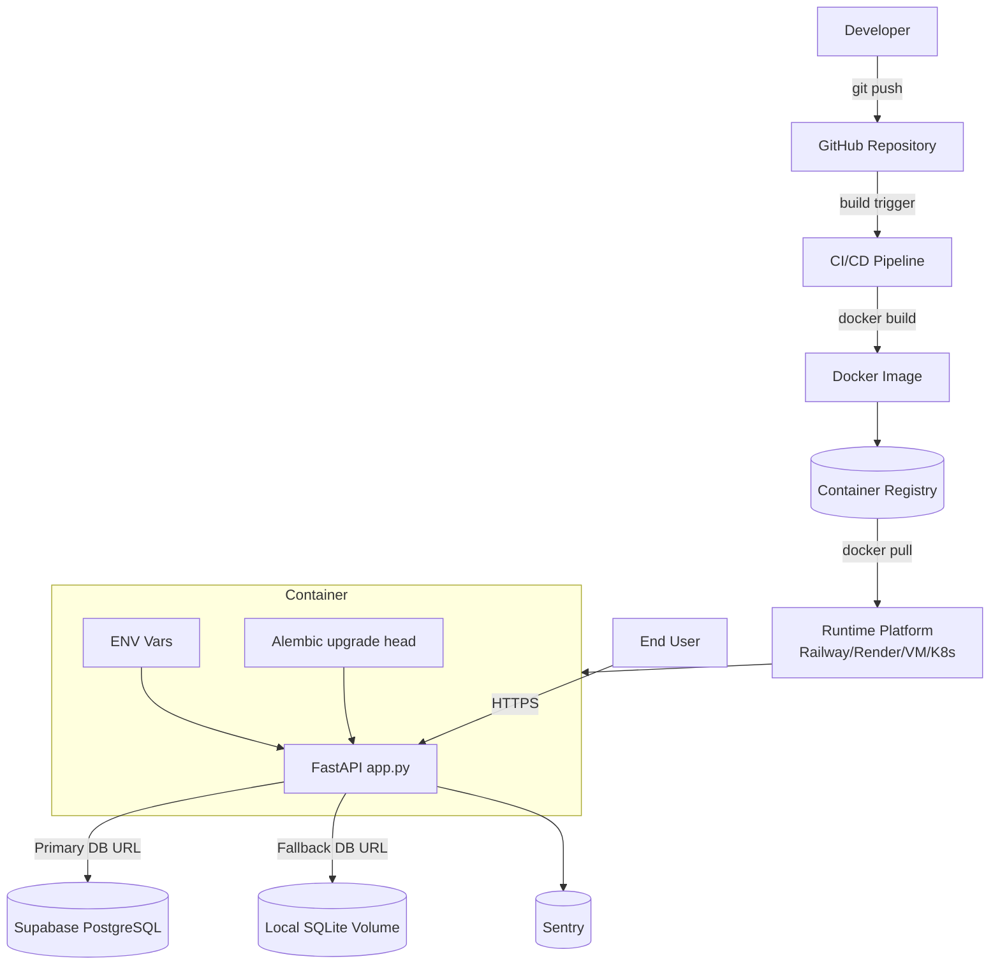

# Docker Deployment Flow

```mermaid
flowchart TD
    Dev[Developer] -->|git push| GH[GitHub Repository]
    GH -->|build trigger| CI[CI/CD Pipeline]

    CI -->|docker build| IMG[Docker Image]
    IMG --> REG[(Container Registry)]

    REG -->|docker pull| RUN[Runtime Platform\nRailway/Render/VM/K8s]

    subgraph CONTAINER[Container]
      APP[FastAPI app.py]
      ENV[ENV Vars]
      MIG[Alembic upgrade head]
    end

    RUN --> CONTAINER
    ENV --> APP
    MIG --> APP

    APP -->|Primary DB URL| SUPA[(Supabase PostgreSQL)]
    APP -->|Fallback DB URL| SQLITE[(Local SQLite Volume)]
    APP --> SENTRY[(Sentry)]

    User[End User] -->|HTTPS| APP
```
