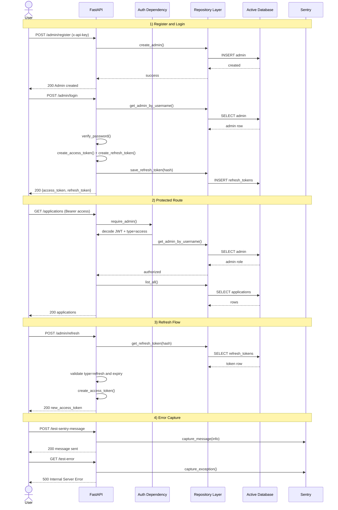

# Flow Control

```mermaid
sequenceDiagram
    actor U as User
    participant A as FastAPI
    participant Auth as Auth Dependency
    participant Repo as Repository Layer
    participant DB as Active Database
    participant S as Sentry

    Note over U,S: 1) Register and Login
    U->>A: POST /admin/register (x-api-key)
    A->>Repo: create_admin()
    Repo->>DB: INSERT admin
    DB-->>Repo: created
    Repo-->>A: success
    A-->>U: 200 Admin created

    U->>A: POST /admin/login
    A->>Repo: get_admin_by_username()
    Repo->>DB: SELECT admin
    DB-->>Repo: admin row
    A->>A: verify_password()
    A->>A: create_access_token() + create_refresh_token()
    A->>Repo: save_refresh_token(hash)
    Repo->>DB: INSERT refresh_tokens
    A-->>U: 200 {access_token, refresh_token}

    Note over U,S: 2) Protected Route
    U->>A: GET /applications (Bearer access)
    A->>Auth: require_admin()
    Auth->>A: decode JWT + type=access
    Auth->>Repo: get_admin_by_username()
    Repo->>DB: SELECT admin
    DB-->>Repo: admin role
    Repo-->>A: authorized
    A->>Repo: list_all()
    Repo->>DB: SELECT applications
    DB-->>Repo: rows
    A-->>U: 200 applications

    Note over U,S: 3) Refresh Flow
    U->>A: POST /admin/refresh
    A->>Repo: get_refresh_token(hash)
    Repo->>DB: SELECT refresh_tokens
    DB-->>Repo: token row
    A->>A: validate type=refresh and expiry
    A->>A: create_access_token()
    A-->>U: 200 new_access_token

    Note over U,S: 4) Error Capture
    U->>A: POST /test-sentry-message
    A->>S: capture_message(info)
    A-->>U: 200 message sent

    U->>A: GET /test-error
    A->>S: capture_exception()
    A-->>U: 500 Internal Server Error
```
